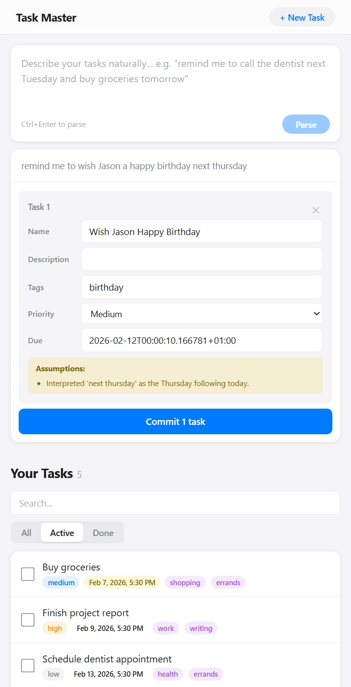

# Task Copilot

A local-only task manager with an AI chat interface that converts messy raw text into structured tasks using a local Ollama language model. No cloud, no auth, everything runs on your machine.

## Features

- Full CRUD task management with search, filtering, and sorting
- Chat interface: paste raw text, AI extracts structured tasks
- Review-before-save: edit proposed tasks before committing
- Tag-based grouping view
- Scheduled (with due date) and unscheduled tasks
- Priority levels: low, medium, high, urgent
- Overdue highlighting
- TinyDB

## Screenshots
<div style="display:flex;gap:12px;flex-wrap:wrap;align-items:flex-start">
   
   
</div>

## Prerequisites

1. **Python 3.11+** — [python.org](https://www.python.org/downloads/)
2. **Node.js 18+** — [nodejs.org](https://nodejs.org/)
3. **Ollama** — [ollama.com](https://ollama.com/)
   - After installing, pull a model (if you don't already have one):
     ```
     ollama pull phi4-mini:3.8b
     ```
4. **MongoDB** (optional) — [mongodb.com/try/download/community](https://www.mongodb.com/try/download/community)
   - Not required! The app automatically falls back to TinyDB (local JSON file) if MongoDB isn't installed.

## Quick Start (One Command)

The easiest way — double-click `start.bat` or run:

```powershell
.\start.ps1
```

This automatically:
- Starts Ollama if it isn't running
- Installs Python/npm dependencies if needed
- Seeds demo data on first run
- Launches backend (port 8000) and frontend (port 5173)

To stop everything:
```powershell
.\stop.ps1
```

## Notes

- The frontend proxies `/api/*` requests to `http://localhost:8000` via Vite's dev server, stripping the `/api` prefix. In production, configure your reverse proxy accordingly.
- If MongoDB is not running when the backend starts, it automatically falls back to TinyDB (a JSON file store). This is seamless — no code changes needed.
- The Ollama model must be pulled before first use (`ollama pull llama3.2:3b` or whichever model you configure).
- Chat parsing uses a strict JSON-output prompt. If the model fails to produce valid JSON, the backend retries once with a stricter prompt before returning warnings.
